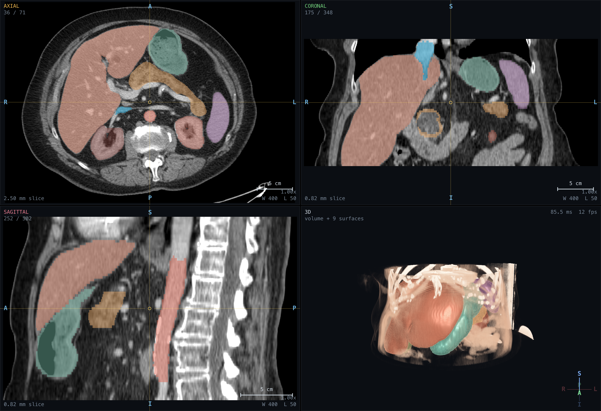
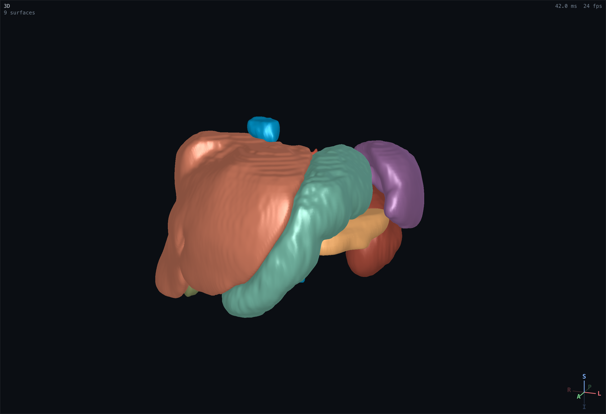
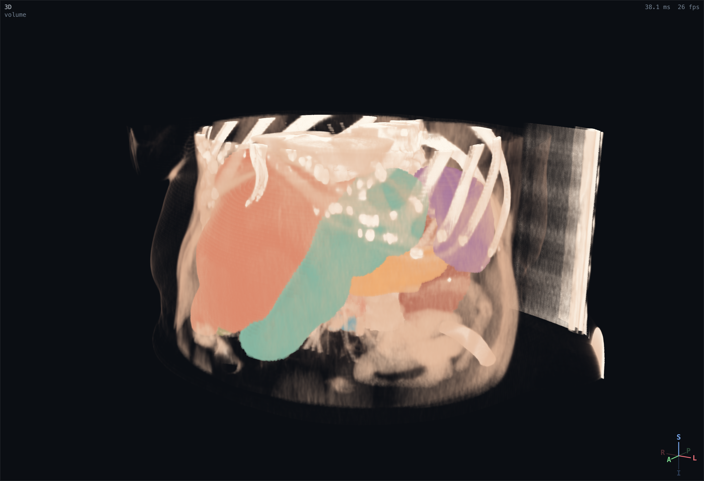
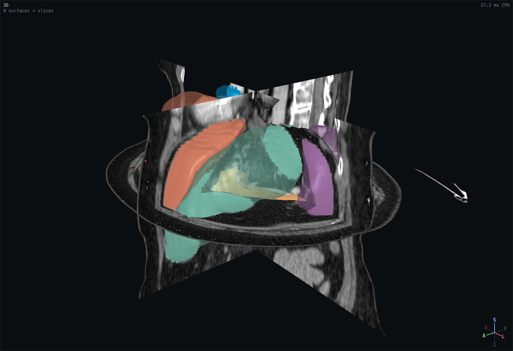
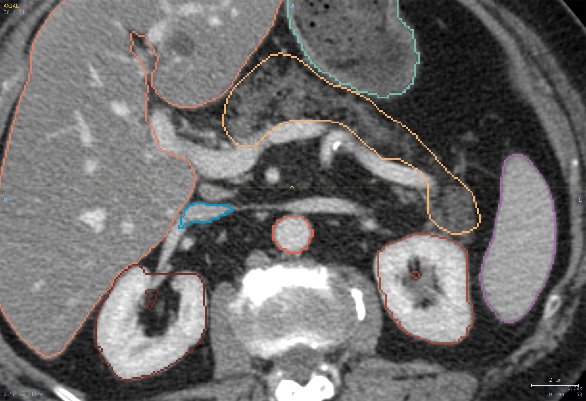

# BodyMaps Viewer

A CT and segmentation viewer that runs entirely in a browser tab. It loads NIfTI
scans and per-voxel structure annotations, reformats them into linked axial,
coronal and sagittal views, raycasts the volume in 3D, and reconstructs each
annotated structure as a smooth surface.

No plugins, no install, no server, and nothing is uploaded. The scan is parsed
and rendered on the machine you open it on.

**[Open the live demo](https://porth-bot.github.io/bodymaps-viewer/)** (loads the
sample abdominal CT automatically, about 16 MB)



I built this for Project 1 of the Johns Hopkins BodyMaps developer call, which
asks for a web application that can visualise CT scans and per-voxel annotated
structures, in the spirit of 3D Slicer but reachable from a URL.

## What it does

**Multiplanar reformatting.** Axial, coronal and sagittal views with a linked
crosshair, drawn in true radiological convention. Patient right is on the
viewer's left in axial and coronal, and the sagittal view faces left, all
derived from the file's own affine rather than assumed. Anisotropic voxels are
scaled correctly, which matters here because the sample case is 0.816 mm in
plane and 2.5 mm through plane, and fitting by voxel count instead of
millimetres would squash the coronal view to a third of its height.

**Windowing.** Nine standard clinical presets on the number keys, a right-drag
window and level like every PACS workstation, and a log-scale voxel histogram
showing which part of the intensity range the current window actually maps.

**Segmentation overlay.** Per-structure colour, visibility and opacity, plus an
outline mode that draws boundaries only so the anatomy underneath stays
readable. Volume in millilitres and mean attenuation are computed for every
structure.

**3D.** Single-pass volume raycasting with a tissue transfer function and
gradient shading, maximum intensity projection, isosurfaces for every structure,
and the three slice planes drawn in place. Surfaces and the volume occlude each
other correctly rather than one always drawing over the other.

**Tools.** Hounsfield probe with the structure name and patient coordinates
under the cursor, a millimetre ruler, a scale bar, an anatomical axis indicator,
and PNG export of the current viewports at full device resolution.

**Anything you drop on it.** Drag a case folder onto the window and it loads.
Any NIfTI orientation works, not just the sample's.

| | |
|---|---|
|  |  |
| Surfaces reconstructed from the nine masks | Volume raycast, seeing through the body wall to the ribs and organs |
|  |  |
| Slice planes and translucent surfaces together | Outline mode, keeping the anatomy visible under the labels |

## How it is built

Written from scratch in TypeScript against raw WebGL2. There is no medical
imaging library, no 3D engine, and no UI framework. The only runtime dependency
is `fflate`, as a fallback for browsers without `DecompressionStream`. The whole
production bundle, both workers and the stylesheet included, is 44 KB gzipped.

That was a deliberate choice. Wiring up an existing viewer would have been a
hundred lines and would have shown nothing, and the parts that are actually hard
here are the parts a library would have hidden.

### Reading the file

`src/core/nifti.ts` parses NIfTI-1 and NIfTI-2, either endianness, the eight
datatypes that occur in practice, and both affine paths, including the
quaternion form with its `qfac` sign convention. `src/core/orientation.ts` then
resolves the affine to an orientation code and resamples the array into
canonical RAS voxel order, so nothing downstream has to think about orientation
again.

Two details are easy to miss and both are load bearing on this dataset:

- The sample scan carries `scl_slope = 0.0305` and `scl_inter = 0.0153`, which
  map the stored int16 range onto exactly [-1000, 1000] HU. A viewer that
  ignores the rescale shows numbers that are not Hounsfield units, and every
  window preset is then meaningless.
- The affine has to be updated when the array is permuted and flipped, or the
  voxel and patient coordinate readouts disagree with the image.

### Rendering

One canvas, one WebGL2 context, four viewports separated with `gl.viewport` and
`gl.scissor`. Four contexts would need four copies of the 25 MB volume texture.

The scan is uploaded once as an `R16F` 3D texture. An 8-bit texture quantises a
2000 HU range into 7.8 HU steps, which visibly bands a 150 HU liver window; full
float doubles the memory for precision nothing can see. Structures are packed
into a single `R8UI` label volume with a 256 entry colour lookup table, so
toggling a structure rewrites 1 KB instead of touching 12 MB, and a raycast
sample costs one label fetch no matter how many structures are loaded.

The 3D view draws opaque geometry into an offscreen target with a depth
*texture*, then the raycaster samples that depth to convert it into a distance
along each ray and stops there. That is what makes organ surfaces and the volume
render occlude one another properly.

### Surfaces

`src/mesh/` extracts isosurfaces with naive surface nets rather than marching
cubes. Surface nets needs no 256-case lookup table to transcribe, is manifold by
construction, and gives better triangle quality on binary label fields.

Masks are blurred into a smooth occupancy field first, because extracting
straight from a 0/1 field puts every crossing at exactly the midpoint between
two voxels and produces stair-stepped organs. Taubin lambda/mu smoothing then
runs on the result, which removes the residual terracing without the volume
shrinkage plain Laplacian smoothing causes.

Writing this surfaced a real defect in the textbook algorithm. A cell can
contain two disjoint sheets of surface, and collapsing both onto one dual vertex
creates an edge shared by four triangles. It is not hypothetical: the reference
liver mask hits it seven times. `pairFaceCrossings` partitions each cell into
its surface components and emits one vertex per component.

One pathological case survives, where a single component leaves and re-enters a
cell through the same ambiguous face. Fixing it properly means subdividing the
cell, which is what manifold dual contouring does and what this deliberately
does not. At the settings the app ships it costs the liver two edges out of
337,000 and leaves the other eight organs strictly manifold. Even at those
edges the mesh is still closed and consistently oriented, so normals and the
divergence-theorem volume stay correct. The top of `surfaceNets.ts` says all of
this rather than claiming a guarantee the code does not quite make.

Extraction runs in a pool of web workers, so the slices stay interactive while
surfaces build in the background.

## Is it correct

Every structure statistic the viewer computes was checked against `nibabel` and
`numpy` reading the same files. The viewer's numbers come out of the full
pipeline: gunzip, parse, rescale, reorient to RAS, then accumulate.

| Structure | Volume (viewer) | Volume (nibabel) | Mean HU (viewer) | Mean HU (nibabel) |
|---|---|---|---|---|
| Liver | 1573.5 mL | 1573.5 mL | 63 | 62.6 |
| Stomach | 394.6 mL | 394.6 mL | -85 | -84.7 |
| Spleen | 182.3 mL | 182.3 mL | 95 | 94.7 |
| Kidney (right) | 108.9 mL | 108.9 mL | 129 | 128.8 |
| Kidney (left) | 107.9 mL | 107.9 mL | 122 | 122.1 |
| Pancreas | 106.3 mL | 106.3 mL | -24 | -24.5 |
| Inferior vena cava | 46.0 mL | 46.0 mL | 112 | 111.8 |
| Aorta | 29.3 mL | 29.3 mL | 143 | 142.5 |
| Gallbladder | 16.8 mL | 16.8 mL | 18 | 18.5 |

Orientation handling was checked end to end rather than only in unit tests. The
sample case was rewritten into LPS with `nibabel` (flipping the i and j axes and
updating the affine so every voxel still maps to the same patient location),
then loaded through the app's own file input. The viewer reported the source as
LPS, resampled it, and recovered every structure centroid to the digit: the
liver came back at (344.2, 200.3, 35.2) in RAS voxel order, having sat at
(156.8, 146.7, 35.2) in the LPS array, and the rendered axial slice was
identical to the original. Volumes and mean attenuation were unchanged.

Orientation was also verified from the anatomy rather than trusting the header. The
liver centroid sits at i = 344 and the spleen at i = 149, so increasing i runs
toward the patient's right; the liver sits superior to the kidneys, so k runs
superior; the gallbladder is anterior to the aorta, so j runs anterior. The
aorta is left of the inferior vena cava in the rendered axial view, which is the
check that catches a left/right flip.

The 186 tests in `tests/` cover the parser against synthesised NIfTI files in
both endiannesses, the quaternion affine path, the RAS resampling (asserting
that `affine_new * voxel_new == affine_old * voxel_old`), and the mesher. Mesh
tests assert closedness and manifoldness by checking every undirected edge is
used by exactly two triangles in opposite directions, and check enclosed volume
by the divergence theorem, which also proves the winding is outward. The real
sample case is loaded from disk in the integration tests, so CI fails if any of
this regresses.

## Performance

Measured on an M-series MacBook in Chrome, on the 502 x 348 x 71 sample case
(12.4 million voxels). Load figures are the median of five cold page loads with
the files served locally, so they are the parsing cost rather than the network.

| Step | Time |
|---|---|
| Read, gunzip, parse, reorient and normalise the scan | 106 ms |
| Read nine masks, reorient them and pack the label volume | 253 ms |
| Extract, smooth and upload nine surfaces | 851 ms |
| Main-thread time per frame, three slice views | 3.2 ms |
| Main-thread time per frame, four up with volume rendering | 8 to 14 ms |

The two per-frame figures are CPU submit time, which is what the readout in
the corner of the 3D pane reports and labels as such. GL calls return once the
command is queued, so this measures how long the main thread is busy, not how
long the GPU takes. It is the number that decides whether the UI stays
responsive, and it is deliberately not dressed up as a frame rate: honest GPU
timing needs `EXT_disjoint_timer_query_webgl2`, which most browsers do not
expose.

Surface extraction alone is 283 ms of CPU for all nine organs, measured
separately in the test suite; the rest is worker startup and buffer transfer.

The ordering matters more than any single number. The scan is posted to the main
thread and drawn before a single mask is touched, so anatomy is on screen in
about a tenth of a second and structures then surfaces fill in behind it. None
of it blocks the UI.

Two changes did most of the work. Packing structures originally scanned all 12.4
million voxels once per mask; restricting each to its own bounding box cut that
step from roughly 800 ms to 253 ms, because the nine structures together occupy
1.5 of those 12.4 million voxels. And the label volume is sent to the mesh
worker pool once at startup rather than per structure, which avoids moving 12 MB
nine times.

## Running it

```bash
npm install
npm run dev
```

Then open http://localhost:5173. The sample case loads on its own.

```bash
npm test          # 186 tests, including integration against the real case
npm run typecheck
npm run build
```

Requires a browser with WebGL2, which means Chrome, Edge, Firefox, or Safari 15
and later.

## Controls

| Input | Action |
|---|---|
| Left drag | Move the crosshair, orbit in 3D |
| Right drag | Window and level |
| Middle drag | Pan |
| Wheel | Scroll slices, dolly in 3D |
| Ctrl or Cmd + wheel | Zoom about the pointer |
| Double click | Maximise or restore a pane |
| 1 to 9 | Window presets |
| Arrows | Step slice, hold Shift for 10 |
| A C S V F G | Axial, coronal, sagittal, 3D, four up, row |
| L, O | Structures on or off, outline mode |
| M, X, P | Surfaces, volume rendering, slice planes |
| H, R, Esc | Crosshair, reset views, clear measurements |

## What I would do next

- **Oblique and curved reformatting.** The slice shader already takes an
  arbitrary plane basis, so oblique is close. Curved planar reformat along a
  vessel centreline is the genuinely useful version.
- **Segment editing.** Brush, threshold and island removal, writing back a
  NIfTI. This is the obvious next thing a viewer used for annotation review
  needs, and the label volume is already the right data structure for it.
- **Streaming large volumes.** A whole-body scan at full resolution exceeds what
  a single 3D texture holds. Bricking with a coarse volume for navigation and
  loading detail on demand is the standard answer.
- **DICOM.** Reading a DICOM series directly would remove the conversion step
  before anyone can look at their own data.
- **Better sampling.** The raycaster jitters ray starts to break up sampling
  rings. Empty space skipping off a coarse occupancy pyramid would let it take
  finer steps where they matter for the same cost.

## Data

The sample case, `BDMAP_00000338`, is the example provided with the BodyMaps
developer call and is redistributed here so the demo needs no setup:
http://www.cs.jhu.edu/~zongwei/dataset/BDMAP_00000338.zip

It is a contrast-enhanced abdominal CT with nine annotated structures, in the
AbdomenAtlas layout of one `ct.nii.gz` plus one binary mask per structure under
`segmentations/`.

Combined multi-label files also work, which is what TotalSegmentator emits by
default: a file holding several distinct values is split into one structure per
value rather than collapsed into a single blob. Each shares the underlying
array and is distinguished by a `matchValue`, so a 117-structure output costs
one 12 MB array rather than 117 of them. Values map to `label_1`, `label_2` and
so on, since no naming convention is carried in the file itself.

Structure colours and display names follow the TotalSegmentator and 3D Slicer
conventions where a standard exists.

## Licence

MIT, for the code. The sample dataset belongs to its original authors.
